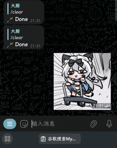
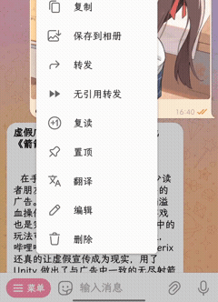
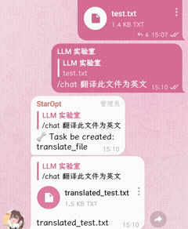

------------------

<p align="center">
<a href="https://hub.docker.com/repository/docker/sudoskys/llmbot/general">
    
</a>
<a href="https://github.com/llmkira/openaibot/actions/workflows/docker-ci.yaml">
    
</a>
<br />
<a href="https://t.me/Openai_LLM">
    
</a>
<a href="https://discord.gg/6QHNdwhdE5">
    
</a>
<br/>
<a href="https://raw.githubusercontent.com/llmkira/openaibot/main/LICENSE">
    
</a>
<a href="https://hub.docker.com/repository/docker/sudoskys/llmbot/builds">
    
</a>
</p>

<p align="center">
  <a href="https://llmkira.github.io/Docs/">🍩 部署文档</a> 
  &
  <a href="https://llmkira.github.io/Docs/dev/basic">🧀 开发文档</a>
  &
  <a href="README_EN.md">📝 English Readme</a>
</p>


> **Look for English README? Click [here](README_EN.md). We also have English
documentation [here](https://llmkira.github.io/Docs/en).**

> 部署遇到问题？提交 Issue 帮助我们提升可用性

LLMBot 是基于消息队列，围绕智能机器人助理概念开发的 IM Bot，可以装载插件完成许多功能。
由 Openai 的新 Feature `gpt-function-call` 支持实现。

| Demo                              |
|-----------------------------------| 
|  | 

与之前的项目不同的是，此项目尝试基于消息平台复刻 ChatGpt 的插件系统，实现部分或更进一步的功能。

> 因为 func call 为 feature,所以只支持 Openai 类型的 api, 不打算支持没有 func call 的 LLM

## 📦 Feature

- 🍪 通过自然语言调用若干预先定义好的功能函数
- 📝 消息系统，定义发送接收端和数据即可递送至链中
- 📎 订阅系统，可以订阅除了结对发送者外的多个发送者，兼具推送功能
- 📦 非问答绑定，不限时间不限发送端触发回复
- 📬 自定义 ApiKey 和 后端，追溯发送者的鉴权信息
- 🍾 交互体验细则
- 🎵 细化的消费数据存储，统计插件的额度消耗情况，全场景追溯消费记录产生
- 🍰 插件的多种注册点
- 📦 文件交互支持
- 🍖 对函数插件的连续会话设计，黑名单设计
- 🍟 支持插件人在回路认证，支持插件原子单人配置，支持开发前置消息文本验证Hook，支持开发文本<->媒体转换器，支持错误禁用 Hook

### 🧀 部分插件预览

| Sticker Converter                   | Timer Func                      | Translate Func                               |
|-------------------------------------|---------------------------------|----------------------------------------------|
|  |  |  |

### 🧀 认证系统介绍

我们采用的认证系统称为 `Service Provider`，即服务提供商，它的作用是为每个发送者分配 Endpoint/Key/Model ，用于鉴权。
拥有一个 `token` 作为绑定的 OpenKey。程序会调用设定的 `Service Provider` 读取私有 Key/配置 Token 来获取鉴权信息。


认证组件和后端均需要自行实现。

### 🎬 平台支持

| 平台       | 支持情况 | 文件系统 | 备注          |
|----------|------|------|-------------|
| Telegram | ✅    | ✅    |             |
| Discord  | ✅    | ✅    |             |
| Kook     | ✅    | ✅    | 不支持 `被回复启动` |
| Slack    | ✅    | ✅    | 不支持 `被回复启动` |
| QQ       | ❌    |      |             |
| Wechat   | ❌    |      |             |
| Twitter  | ❌    |      |             |
| Matrix   | ❌    |      |             |
| IRC      | ❌    |      |             |
| ...      |      |      | 创建Issue/PR  |

## 📦 快速开始

阅读 [🧀 部署文档](https://llmkira.github.io/Docs/) 获得更多信息。

请提前用 `python3 start_sender.py`  `python3 start_receiver.py` 测试是否能正常运行。

### 🥣 Docker

Build Hub: [sudoskys/llmbot](https://hub.docker.com/repository/docker/sudoskys/llmbot/general)

#### 自动 Docker/Docker-compose安装

如果你在使用一台崭新的服务器，你可以使用下面的Shell来尝试自动安装本项目。

此脚本会自动使用 Docker 方法安装所需服务并映射端口，如果您已经部署了 `redis` ，`rabbitmq` ，`mongodb` 。

请自行修改 `docker-compose.yml` 文件。

```shell

curl -sSL https://raw.githubusercontent.com/LLMKira/Openaibot/main/deploy.sh | bash
```

#### 手动 Docker-compose安装

```shell
git clone https://github.com/LlmKira/Openaibot.git
cd Openaibot
cp .env.exp .env&&nano .env
docker-compose -f docker-compose.yml up -d

```

### 🍔 Shell

人工使用Pm2启动，需要自行安装 `redis` ，`rabbitmq` ，`mongodb` 。

```shell
git clone https://github.com/LlmKira/Openaibot.git
cd Openaibot
pip install -r requirements.txt
cp .env.exp .env&&nano .env
apt install npm -y && npm install pm2 && pm2 start pm2.json
pm2 monit

```

重启程序使用 `pm2 restart pm2.json` 。

## 🍪 Slash Command

```shell
clear - 删除聊天记录
help - 显示文档
chat - 对话
task - 启用函数以对话
ask - 禁止函数以对话
tool - 列出所有函数
set_endpoint - 设置私有 key 和 endpoint
clear_endpoint - 清除私有 key 和 endpoint
auth - 授权一个函数
env - 函数环境变量
token - 绑定令牌
token_clear - 清除令牌绑定
func_ban - 禁用一个函数
func_unban - 解禁一个函数
bind - 绑定消息源
unbind - 解绑消息源
```

## 💻 如何开发插件？

插件开发文档请参考 `plugins` 目录下的示例插件和 [🧀 插件开发文档](https://llmkira.github.io/Docs/dev/basic)

## 🤝 We need your help!

We can't do it on our own at the moment:

- [ ] We need help with the documentation
- [ ] Web UI

Feel free to submit a Pull Request or discuss, we'd love to receive your contribution!

## 📜 告知

> 此项目与 Openai 官方无关，全称为 OpenAiBot，表示开放人工智能机器人，并不表示为 Openai 所属机器人。

> 如果您所在辖区禁止使用 Openai 服务，请勿使用此项目。

[](https://app.fossa.com/projects/git%2Bgithub.com%2Fsudoskys%2FOpenaibot?ref=badge_small)