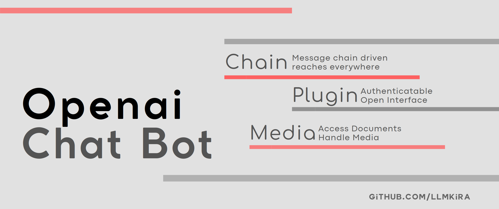

-----------------------

[](https://hub.docker.com/repository/docker/sudoskys/llmbot/general)


[](https://t.me/Openai_LLM)
[](https://discord.gg/6QHNdwhdE5)

[中文手册](README_CN.md)

LLMBot is a message queue based IM Bot developed around the concept of an intelligent robot assistant that can be loaded
with plugins to perform many functions. Implemented with Openai's new Feature `gpt-function-call`
support.

| Demo                              | 
|-----------------------------------|
|  |  |

Unlike previous projects, this project tries to replicate ChatGpt's plugin system based on the messaging platform,
implementing some or more features.

> Because func call is a feature, it only supports Openai type api, and does not intend to support LLM without func
> call.

## 📦 Feature

- 🍪 Call a number of pre-defined functions in natural language.
- 📝 Messaging system, define send receivers and data can be delivered to the llm chain.
- 📎 Subscription system, which can subscribe to multiple senders in addition to paired senders, with push functionality.
- 📦 Non-question-and-answer binding, unlimited time and unlimited sender triggered response.
- 📬 Customizable ApiKey and Endpoint, traceability of sender authentication info.
- 🍾 Easy Interactive Experience.
- 🎵 Fine-grained consumption data storage, statistics on plugin credit consumption.
- 🍖 Continuous session design for function plug-ins

### 🧀 Preview of some plugins

| Sticker Converter                   | Timer Func                      | Translate                                    |
|-------------------------------------|---------------------------------|----------------------------------------------|
|  |  |  |

### 🎬 Platform support

| Platform | Support | Tip     |
|----------|---------|---------|
| Telegram | ✅       |         |
| Discord  | ❌       | Working |
| QQ       | ❌       |         |
| Wechat   | ❌       |         |
| Twitter  | ❌       |         |

## 📝 Deployment Guide

Make sure your system is UTF8, `dpkg-reconfigure locales`

Please make sure that your server has more than `1G` of RAM, otherwise it will reboot indefinitely with PM2.

If you are using a brand-new server, you can use the following shell to automatically install:

```shell
curl -sSL https://raw.githubusercontent.com/LLMKira/Openaibot/main/deploy.sh | bash

```

### 🌻 Configuration

- (Optional) Resolving conflicts

  `pip uninstall llm-kira`

- Clone the project

```bash
git clone https://github.com/LlmKira/Openaibot.git
cd Openaibot
pip install -r requirements.txt

```

- 🛠 Configure the `.env` file

```bash
cp .env.example .env
```

- ⚙️ Install dependencies

```bash
pip install -r requirements.txt
```

- 🗄 Configure the database environment

```bash
# Install Redis
apt-get install redis
systemctl enable redis.service --now
```

```bash
# Install RabbitMQ
docker pull rabbitmq:3.10-management
docker run -d -p 5672:5672 -p 15672:15672 \
        -e RABBITMQ_DEFAULT_USER=admin \
        -e RABBITMQ_DEFAULT_PASS=admin \
        --hostname myRabbit \
        --name rabbitmq \
        rabbitmq:3.10-management 
docker ps -l
```  

## ▶️ Run

### Docker

```shell
cd Openaibot
docker-compose -f docker-compose.yml -p llmbot up -d llmbot --compatibility

```

Install docker can refer to [docker docs](https://docs.docker.com/engine/install/)

Install docker-compose can refer to [docker-compose docs](https://docs.docker.com/compose/install/)

Install docker-desktop can refer to [docker-desktop docs](https://www.docker.com/products/docker-desktop/)

### PM2

````
apt install npm
npm install pm2 -g
pm2 start pm2.json
````

### Shell

```bash
python3 start_sender.py
python3 start_receiver.py

```

## Basic commands

```shell
help - help
chat - chat
task - task
tool - tool list
bind - bind optional platforms
unbind - unbind optional platforms
clear - Delete your own records
rset_endpoint - customize the backend
rset_key - set openai
clear_rset - wipe custom settings

```

### 🥽 Environment variables

| Variable name       | value | Description                                      |
|---------------------|-------|--------------------------------------------------|
| `LLMBOT_STOP_REPLY` | 1     | Stop receiver to reply if value is 1             |
| `LLMBOT_LOG_OUTPUT` | DEBUG | Print LONG debug log on screen if value is DEBUG |

## 💻 How to develop?

For plugin development, please refer to the sample plugins in the `plugins` directory.

- [ ] TODO: Plugin development documentation

## 🤝 We need your help!

We can't do it on our own at the moment:

- [ ] Security checks on procedures
- [ ] User Auth System

Feel free to submit a Pull Request or discuss, we'd love to receive your contribution!

