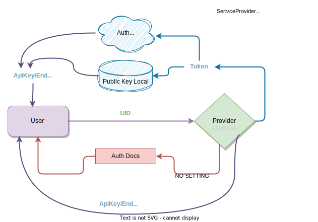

# 链消息系统

> 虽然是异步响应，但是通过链式启动(父子节点)，可以实现同步顺序。

我采用图式对话启动代理，通过消息链条的方式进行消息的传递。

用户需求初始对话作为根节点，可以滚动衍生对话，连续完成操作。同时根据动态策略调整任务元信息。

## 任务认证机制

采用重发器控制链条中断续发。

## 动态插件传递

字面意思，这是一个特性。

# 交换系统

我们的目标是实现一个类邮件的消息交换机系统，这个系统可以在不同的系统中进行消息的传递，同时可以在不同的系统中进行消息的回复。
接受消息的系统，我们称之为“接收者”，发送消息的系统，我们称之为“发送者”。
消息带有始地址和终地址，分配给 平台和 ID，采用通用的消息格式，可以在不同的系统中进行传递。

```
Telegram -> RabbitMQ -> Telegram
Rss -> RabbitMQ -> Telegram
Api -> RabbitMQ -> Telegram
```

由各种发送器提起请求，带上终末地址，交给 OpenAi的核心函数(end_user)，调用函数核心函数返回结果，然后通知过去。

任务产生 -> 任务队列 -> 任务处理 -> 任务队列 -> 任务消费

涉及跨进程通信，需要使用消息队列，消息队列的实现有很多，我们选择 RabbitMQ。

## 创建生产者还是

消费者就是平台数目，所以消费者是有限的。

生产者由平台的用户定义并创建，有多个。

可以一起绑定一个消息队列（订阅模式），也可以使用主题模式自动分流生产者的消息。

所以消费者队列和平台绑定。

## 认证

https://www.cnblogs.com/yanzhi-1996/articles/11115010.html#exchange%E6%A8%A1%E5%9E%8B

对于生产者，有两个分类：匿名生产者和认证生产者。匿名生产者如Rss 没有用户信息，认证生产者如Telegram有用户信息。
所以对于匿名生产者，我们需要在消息中加入用户信息，也就是Redis订阅列表。在生产消息的时候，乘订阅列表发送不同 tag 的消息。

订阅的数据类应该是这样的： 平台，Userid

```python
# 声明一个队列，用于接收消息
channel.queue_declare(queue='telegram', durable=True)
channel.basic_publish(exchange='',
                      routing_key='水许传',
                      body=Message()
                      )
```

## 中间件

Openai 作为消息中间件，修改消息并转发。
如果遇到了function, 则调用function，自身作为creator发送消息。

## 订阅的实质

消息的路由。`消息类:消息源` 和 `平台:用户id` 的映射。

消息类需要了解谁订阅了这个消息类，所以需要一个消息类的订阅列表。

而我们也需要知道谁订阅了多少，所以需要一个用户的订阅列表。

```json5
{
  "rss": {
    "telegram": [
      {
        "user1": "url1"
      },
      {
        "user2": "url2"
      },
    ],
  }
}
```

```json5
{
  "rss": {
    "url1": [
      {
        "user": "platform"
      },
      {
        "user": "platform"
      },
      //...
    ]
  }
}
```

```json5
{
  "user1": {
    "rss": "",
  }
}
```

```json5
[
  {
    "from": "rss",
    "to": "telegram",
    "user": "user1",
    "url": "url1"
  }
]
```

## 插件的公共资源 / 插件管理器的设计

```
meta.json -> 所需第三方库资源和各种信息，每个文件的注册路径
public/... # 静态资源
plugin.py # 插件主文件
```

同时 public 中有公共的变量管理器供插件交互。

具体设计可以参考 none_bot （虽然机制不一样）

### 插件的实质

针对问题进行链式启动，直到执行完毕。不再局限于一问一答和文字形式。

## 插件的确认机制

对于插件操作，如果需要确认怎么办？

方案：我们可以发送命令请求信息，然后暂存当前请求链和 TaskHeader，然后命令 ``/confirm form_id`` 来确定链的继续进行和取消进行。

由此延伸，插件的表单输入也可以用暂存链。

所以需要做 暂存链管理器 + 参数修改 的人回路。

## 动态消息组构建

出于对文件系统的考虑，我们需要一个 **动态消息组构建器** ，可以从文件事件中抽取相关事件。

由于消息系统的特殊性，所以可以只在历史记录中显示简报，用插件处理数据。

## "非活动接受者"

对于非活动接受者，比如 Github Issue 平台，我们如何让Telegram和其连接？

采用订阅器即可解决此问题。

### 多响应方案

虽然收发广播机制看似完美，但是在实际使用中，我们发现了一个问题：**多响应**。

每次我们最多调用一个响应函数，但是在某些情况下，我们需要调用多个响应函数。

拟定方案：
方案 1. 传入拆解函数，衍生多个响应函数。
方案 2. 设定重复调用循环链条，由计数器和结束标记插件控制结束。代发机制的利用。
方案 3. “申请”运行时，然后启动问询插件。代发机制的利用。比较合理的方案。

真正实施下来，是截断+修改路由+衍生子节点+产生部署点。

同时跟踪每个节点的走向，设置递归深度，超过深度则截断。

同时要针对多任务和单任务做不同的削减策略。

### 私有 Env 设置

需要一个私有 Env 设置，用于存储私有信息。已经做了。

## Meta 信息头的暗桩

为了指示消息的处理阶段，我们有一个由混乱的命名规则组成的元信息头，这个可能是一个问题。

根据此，我们定义了一些类路由。

### 并发和顺序

因为要求吞吐量，所以 ack 被放在开头。

但是这样就不能保证某些流程链条的顺序了。

所以打算添加一个缓存器，用于存储消息，然后在消息结束重新启动。

这个实现被链式启动机制实现了。

## “权限” 认证

添加同级的 receiver 组件进行 **认证重发**，我们需要一个认证组件，将需要认证的操作进行存储，然后通过命令释放带有通过标记的请求。（重新代发）

权限认证只需要存储receiver的前置参数即可。

数据结构设计是：

user id 后台校验，同时提供一个线程ID用于定位。

此认证组件和链式启动机制被巧妙的结合了。

### 插件系统的冗余设计

https://github.com/LlmKira/Openaibot/issues/284

### 必须收发分离

这可能对某些平台是一个问题，我们的系统必须实现两个实例才能分离收发，必须有一个同步API。在收端启用轮询，

### 转换器

媒体转换器，不妨碍LLM执行链条，将文本转换为媒体，然后发送。

### 重点在于变化

记录应该是变化的，用户主动时候隐藏引子，而机器人主动的时候可以 “假设” 代发请求来完成衍生任务。

这里被动态消息组构建器实现了。

## 多后端必要性的论证

在非 Function Call 场景下，可以使用其他的 LLM 回应消息。

但是目前本项目已经和 Openai 深度绑定，所以这是一个低优先级事项。

> 这里被多后端兼容性实现了。根据模型决定后端。

# 问题

### 产品定位

针对个人还是多人？

也许需要引入关系型数据库。

### 同发送者消息上下文合并

LLM 会不会有表现提升？

### 失败的补偿处理

错误禁用，手动复位。需要一个计数器。Func Loader 需要好好打磨。
https://github.com/LlmKira/Openaibot/issues/268

### 代码执行器

可能不是好想法。

因为依赖库是社区维护，动态更新的，人为构建的。

LLM作为由语料生成的代码，会很多问题。可用性和覆盖度随时间下降。只能寄希望于重新训练。

而且这个想法需要一个 sandbox,总不能让用户在服务器随便执行代码吧。

有个项目全程使用 沙盒，某种意义上很像。

https://github.com/OpenBMB/XAgent

### 服务提供者

> 要么配置你的key,要么什么都不做，要么配置你的token！

1. 公共实例：直接环境继承
2. 私有认证：自己的key 或者
3. 代理公共配额：没有自己的后端，需要分配公共配额，比如 学校/公司 的公共配额

其中我们不需要管 2 ,用户填入其实就可以使用了。

我们需要实现 1 和 3 的合并。

实现代理认证模式。

新建一个 provider,代为提供使用环境变量的授权。

Provider 的作用，节流，放权。

````
endpoint
key
token // 绑定的 token 默认为 None
````

**因一台机器只有一个Key公共，所以Provider由环境变量提供。**

provider 不为空时，则启用此模式。

**公共的 provider 自己直接根据每日配额进行限制，进行本地认证**

**将用户的token转换为一个 Driver 对象，网络认证**



### RAG

Langchain 的 RAG 模型是一个很好的参考。

https://python.langchain.com/docs/use_cases/chatbots/

https://github.com/langchain-ai/langchain/issues/12375

https://python.langchain.com/docs/modules/agents/agent_types/react

## 关于 Langchain

这个稍微有点复杂的框架我还是很喜欢的，因为它的设计思想很好。 就是我不太喜欢它的语法。

如果要使用这个框架，作为一个非API端的框架，它连带着函数运行都做完了。 我很好奇我的人在回路鉴权在哪里放。

我更需要的是一个能回复消息+回复调用需求的框架。Langchain 做的太多了太杂了，甚至自己独立就能成为Shell程序，我只是在取下它最后的结果而已。

## 关于 XAgent

https://github.com/OpenBMB/XAgent

很合我心意的一个项目，果然大家都是有相同的需求的。

也有所谓人在回路，而且还有 沙盒可以用。

如果用本地模型的话，不需要担心费用问题。很看好。

## 图像理解

seg anything 转化为 对应的子识别区域。借助 ocr 还有去结构化。也许可以达到效果。

需要，一个外部的工具服务器。核心的内存负载不能破坏。

## Openai 的商业化

Openai 的业务逻辑 Api 终于开始开放了。更多的业务逻辑参与会破坏社区兼容性，需要额外小心。

## 应对 tools

链系统默认是一节点一注册的。既然有多执行。那我们可以在创建任务时候就指定其节点的属性。
同时加入标记。

## 插件的开发实质

回写一些消息回去，并发送消息。记忆和复述。

## 动态配对系统

既然要求每个 tool call 对应一个回复。我们可以预填补空位。然后动态构建更新新的结果。

## self recognize

自我识别，自我认知。

读自身状态。

## 插件的禁用系统

需要更智能。

## 系统的维护

schema 必须独立。

## 大模型的剑走偏锋

AGI：情绪不拟人，反而要用人的方式操作物理GUI。

审查：语言模型最大的优势本来就是情绪价值。

## 自我回流

## 语言模型的优势

## 应用性

## 释放链是否需要强匹配

## 评估 Openai 的 Assistant 的实现

https://platform.openai.com/docs/assistants/how-it-works/runs-and-run-steps

这个实现很像Github的CI/CD。

我们采用的是简单的 Meta + 简单队列的方式。

不足之处：我们混合了无数线程，导致预料外的排序预期。

```python

run = client.beta.threads.runs.create(
    thread_id=thread.id,
    assistant_id=assistant.id,
    model="gpt-4-1106-preview",
    instructions="additional instructions",
    tools=[{"type": "code_interpreter"}, {"type": "retrieval"}]
)
```

这实际上是一个 `Batch` 的实现。这种私有实现我是应该不会接入的。因为和我们整个系统都冲突了。

不过仍有参考价值。我们需要调整schema,增加线程设计。更加规范化 “子链递送”，排查所有的 TaskHeader 子类产生。

`instructions` 这个字段，和我们插件的管理器 Access 是相对应的。

### GPTs

网页的设计本身就是一个限制。虽然他们的设计很好，但是实用性集成性不足。

既然要 Function 了... 仍然像小程序一样工作，可能并不会很好。而且这个设计本身就有账户权限的准入门槛。

现在受欢迎的都是 集成，copilot,小爱,这些都是和生产环境集成的。

### 核心方向

- 查询构建解决方案
- 格式化工作流输入

没有实业的参与，不会提升生产力。

从企业构建上说，客服组件，工单系统的NLP替换，这些都是很好的方向。

传统的订单下单模式，甚至也可能被替换为交互式的。

除了 inspecter 大概能做，其他都不太行。

本框架的核心方向是，**构建一个可配置组件的协作平台**。

那么基于 Bots 的话，有些地方还是不合格的，比如，命令自定义，这个就没有自定义 hook 的选项。

订单 shcema -> 信息索引 + 交互提取 -> 确认。

其中前两步写一点包装其实就可以用了。要想清楚框架的存在意义。

## 平台指定支持

插件需要支持平台指定，这个是一个很重要的功能。

## 通道

通道是一个很重要的概念.

我们依赖这个来充当事件的调度器。让链可随时启动。
